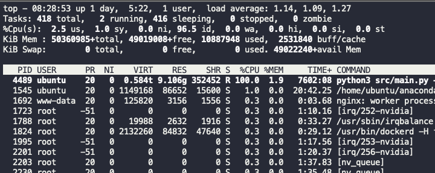

# 시작하며

R 과제로 시작해서 Python과 pandas를 넘어 Golang, k8s로 넘어오기까지 매번 모르는 것이 너무나 많았고 번번히 구글링 땜빵만 해왔다.
이번 기회에 내 code가 컴퓨터에서 어떻게 돌아가는지의 개념을 기초부터 정리해본다.
내가 가장 오랫동안 본 `top`에서부터 시작한다.

## top

기본적인 설명은 자료가 많다. <https://sabarada.tistory.com/146>
가장 잘 보이는 cpu, memory 항목의 주요 개념과 구글링 쿼리를😅 알자.

## cpu

머신러닝 학습을 빠르게 하려면 어떻게 해야하는지 항상 궁금했다.

cpu는 많이 쓸 수록 좋다. 
python 프로세스는 cpu가 100%로 제한되므로 `multiprocessing`을 통해 프로세스 N개로 나눠
띄울 수 있다. 여기서 spawn, fork 개념이 나온다.
`numpy, sklean`와 같은 좋은 패키지는 `cython nogil`로 100% 제한을 해제한다. <https://github.com/scikit-learn/scikit-learn/blob/844b4be24d20fc42cc13b957374c718956a0db39/sklearn/decomposition/_cdnmf_fast.pyx>
`pytorch`에선 `openmp`를 통해 동일한 연산을 한다. <https://github.com/pytorch/pytorch/blob/master/aten/src/ATen/ParallelOpenMP.h#L22>  

cpu의 기본 명령어는 데이터 읽기/쓰기, 가감승제, and, or 연산과 같이 간단하다. 아무리 복잡한 프로그램도 이런 cpu 명령의 조합이다.
별도로 matrix 연산 속도를 위한 SSE, MMX 명령어가 있고 이를 intel mkl 라이브러리에 구현한다. 
`numpy`의 성능은 mkl과 같은 blas에서 온다. 

기본적으로 cpu에게 효율적으로 일을 시킬 수 있는 compiler가 중요하다. <https://sungjjinkang.github.io/c++/computerscience/2021/03/22/SIMD.html> 
동일한 로직도 compiler가 잘하면 성능이 좋아지며 `numba jit compiler`가 있는 이유다.

cpu의 효율은 cache(L1, L2)에 달려있다. 연산 성능만 따지면 cpu는 기가헤르츠 단위의 연산을 할 수 있지만 
연산에 필요한 데이터를 가져오는 속도는 이를 못 받쳐준다. <https://formulusblack.com/blog/compute-performance-distance-of-data-as-a-measure-of-latency/>
따라서 cache 영역에 핏한 데이터로 가공해야 연산 성능이 오른다. 
이러한 전략을 cache miss를 줄인다고 하며, `numexpr`에서 볼 수 있다. <https://numexpr.readthedocs.io/projects/NumExpr3/en/latest/intro.html#>
memory 할당도 cpu의 일이므로 copy보다 inplace update가 더 빠르다.

cpu는 설계 단위로 보면 socket - core - thread 로 볼 수 있고, 데이터는 cache - memory 로 볼 수 있다.   
socket은 cpu가 물리적으로 붙어있는 단위로 numa를 socket 단위로 잡는다.
물리코어는 2개의 논리코어를 가지며 cache를 공유한다. 
m5.16xlarge는 2 socket 각 32 core 가운데 16 물리코어 구성이다.

top으로 cpu 개수를 확인할수 있고 cpu마다 논리코어인지 물리코어인지 확인한다. `cat /sys/devices/system/cpu/cpu3/topology/core_id`
논리코어를 끄면 `chcpu -e 16,17,18,19,20...` openmp를 활용한 병렬처리 성능이 향상됨을 확인했다.
ml workload에서는 동일한 물리 코어의 cache를 경쟁하는 상황이 되어 hyper thread 성능이 떨어진다.
다른 방법으로 환경변수 `OMP_NUM_THREADS;OMP_PROC_BIND;GOMP_CPU_AFFINITY`로 동일한 효과를 줄 수 있다. 

## memory

`top`의 memory 관련 지표 가운데 buff/cache와 Swap은 생소하다. 

memory에 올라간 데이터를 읽어오는 atomic한 단위가 word이고 32bit/64bit가 word 크기이다. OS의 32bit/64bit하고 연결된다. 
그래서 unique id를 설계할 때 8 byte 크기를 고수하는 것이다. cpu의 bit와 혼동하지 말자.

`/proc/$PID/mem`으로 heap, stack에 할당된 값을 확인할 수 있다.

NUMA는 cpu socket 단위로 메모리

### spawn, fork

간략히 spawn은 child에서 조작한 data를 parent에서 볼 수 없지만 fork는 볼 수 있다. fork는 parent memory를 share하고 copy on write가 발생한다.
(`top`의 `SHR`)

### jvm, pvm

python도 jvm처럼 pvm이 있다. `*.py`는 byte code로 `__pycache__`에 생성된다. 
pvm은 byte code를 실행한다. `import dis; dis.dis([i for i in range(5)])`는 실제 코드가 어떤 byte code가 되는지 보여준다.

pvm은 <https://leanpub.com/insidethepythonvirtualmachine/read>

python runtime <https://luavis.me/python/python-malloc>
go도 비슷하게 heap에 데이터를 쓰고 function에서 stack을 쓴다.

### gc

java, python, go 모두 mordern language여서 gc 개념은 비슷비슷하다. 
gc는 객체를 young/old generation (generational hypothesis)으로 나누어 young 위주로 free를 일으키고
그 과정에서 stop the world가 발생한다.

## process

### /proc

`top`의 데이터 소스이며 <https://tldp.org/LDP/Linux-Filesystem-Hierarchy/html/proc.html> os의 모든 process 정보를 가진다. 
sysctl은 /proc을 수정하는 명령어. <https://en.wikipedia.org/wiki/Procfs>

### spawn, fork

이로 발생한 프로세스는 child가 되고 parent 종료시 함께 종료된다. `top`의 `V` 옵션은 tree 형태로 부모 자식을 표현한다.